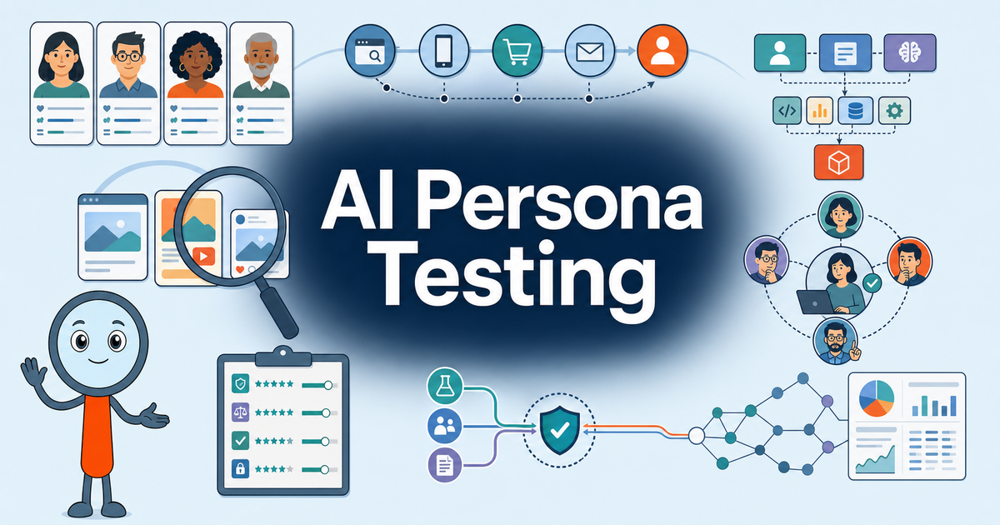

# AI Persona Testing

<figure markdown>
  [{ width="100%" }](chapters/01-ai-customer-research/index.md)
</figure>

Build practical, repeatable systems for testing marketing ideas with AI
personas—without confusing synthetic reactions with evidence from real
customers.

This free, interactive textbook guides marketing professionals from the
foundations of AI-assisted customer research through persona design, prompt
testing, multi-agent workflows, evaluation rubrics, knowledge graphs, and
automated reporting. No programming experience is required.

!!! mascot-thinking "Evidence or Inference?"
    { class="mascot-admonition-img" }
    AI personas can help you explore possibilities and expose weak assumptions.
    What supports the claim—and what still needs to be tested with real people?

## What You Will Learn

By working through the book, you will learn how to:

- design useful, evidence-grounded customer personas
- write prompts that produce structured and repeatable evaluations
- recognize hallucinations, bias, persona drift, and unsupported confidence
- orchestrate persona, moderator, skeptic, analyst, and expert agents
- evaluate marketing assets with rubrics, scores, confidence ratings, and traceable evidence
- turn findings into prioritized recommendations, knowledge graphs, and reports
- build a governed, no-code AI persona testing workflow

## Explore the Book

- **[20 Chapters](chapters/index.md)** — Follow a prerequisite-aware path from
  research foundations to a complete capstone system.
- **[Interactive MicroSims](sims/index.md)** — Practice research design,
  persona construction, prompt testing, orchestration, and evaluation in the
  browser.
- **[Learning Graph](learning-graph/index.md)** — Explore how the book's 400
  concepts connect and which ideas support later skills.
- **[Chapter Quizzes](chapters/01-ai-customer-research/quiz.md)** — Check your
  understanding with explanations and immediate feedback.
- **[Glossary](glossary.md)** — Look up precise definitions for the core
  concepts used throughout the course.
- **[FAQ](faq.md)** — Find concise answers to common questions and follow links
  into the relevant chapters.

## Who This Book Is For

This book is designed for marketing managers, brand strategists, product
marketers, UX researchers, customer-experience professionals, consultants,
agency teams, founders, and business leaders. You need basic computer skills,
familiarity with marketing, and curiosity about AI—not a background in
programming, statistics, or machine learning.

## How to Use This Book

New to AI persona testing? Begin with Chapter 1 and work through the chapters
in order. Each chapter builds on concepts introduced earlier and includes
interactive practice and a quiz.

Already experienced with AI or customer research? Use the learning graph and
chapter overview to identify the shortest safe path to the topic you need.

[**Start Chapter 1: AI-Powered Customer Research Foundations →**](chapters/01-ai-customer-research/index.md){ .md-button .md-button--primary }

[About this book](about.md){ .md-button }
